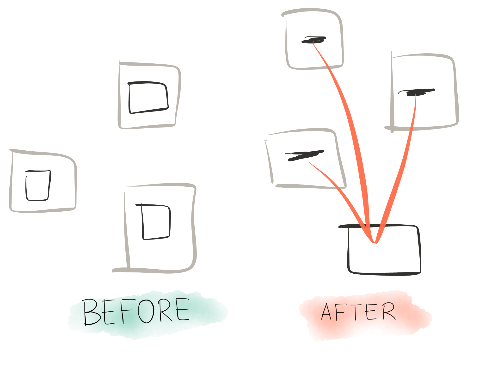
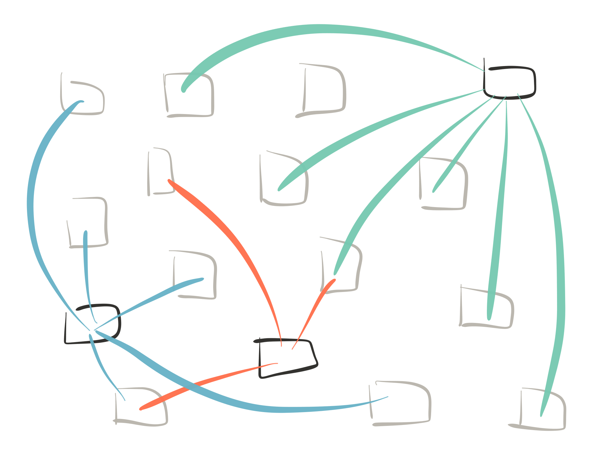
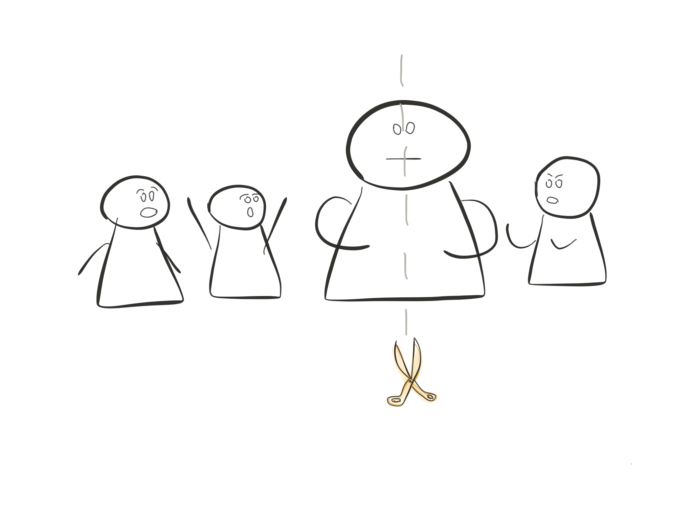
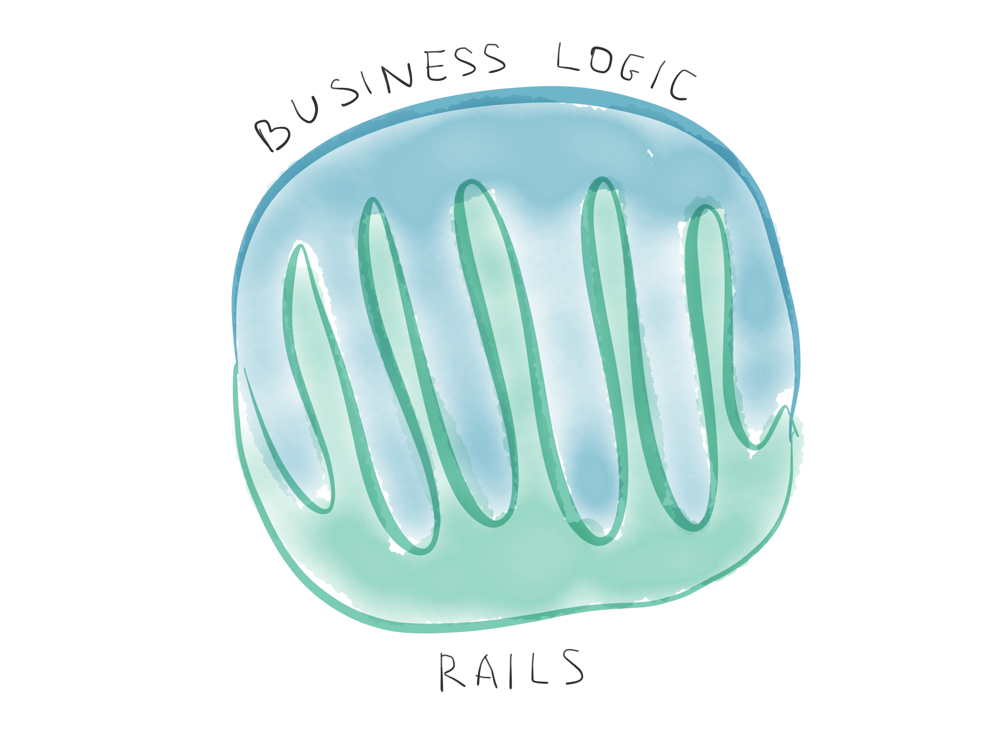
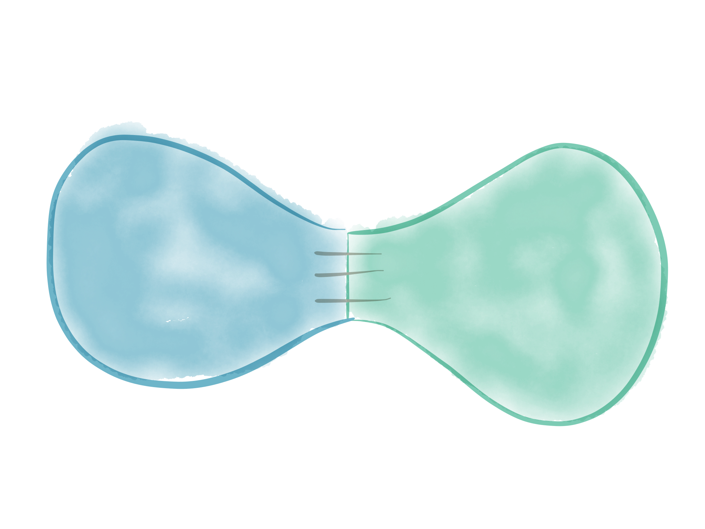
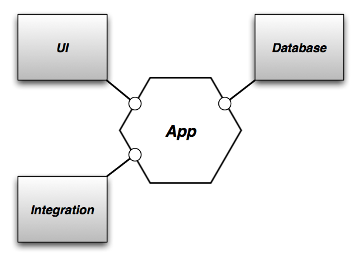
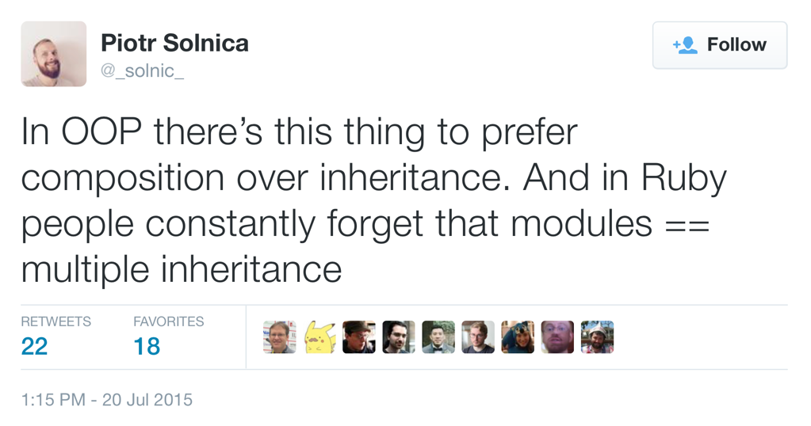
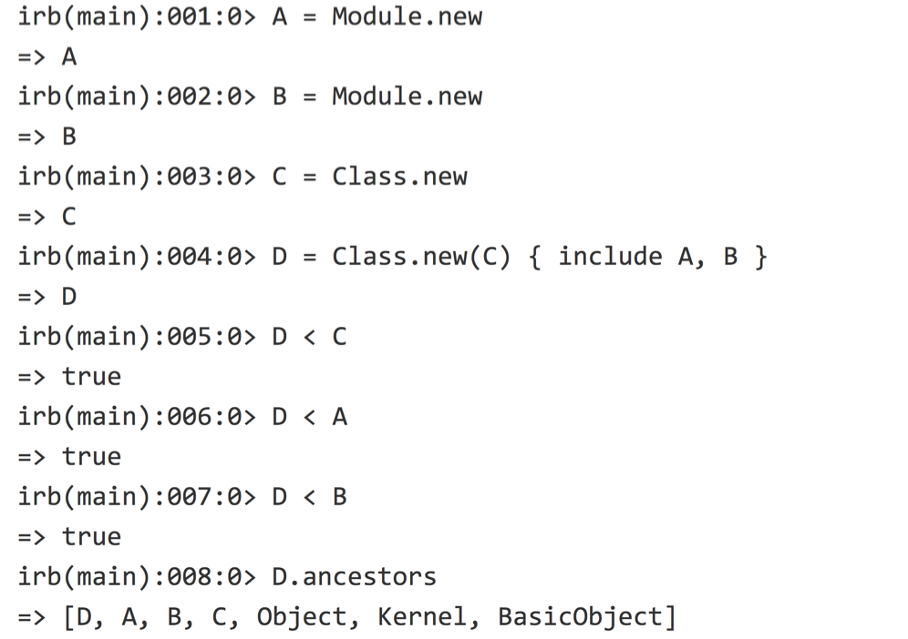
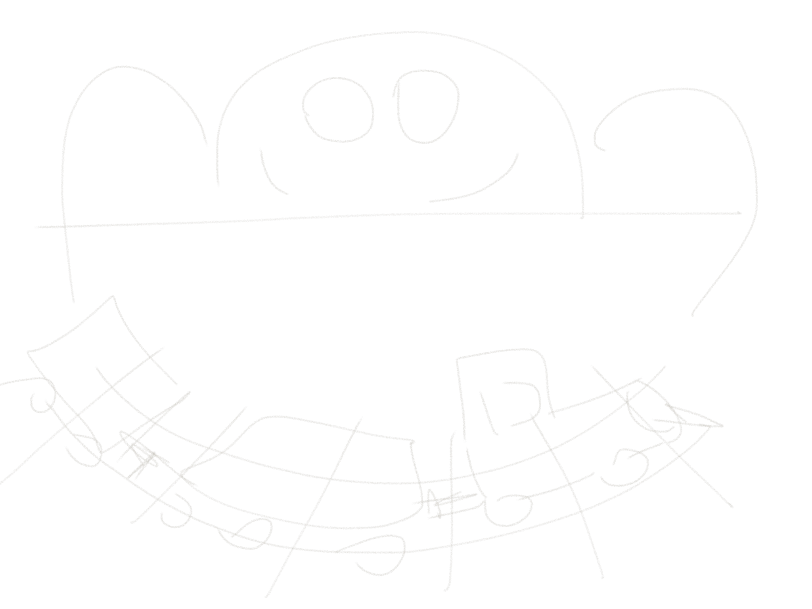

build-lists: true
autoscale: true
<!-- footer: Principles. Misunderstood. Applied. -->
## Principles.  Misunderstood.  Applied.
#### Ivan Nemytchenko, 2015 //Omsk

---

- phyzfack
- 3 years in webdev companies
- freelance on rails
- company of 4
- company of 15
- back to development

---

#Principles

---

- DRY - "Do not repeat yourself"
- KISS - "Keep it simple, stupid"
- Convention over configuration
- Fat model, skinny controller
- Rails is not your application
- YAGNI - "You aren't gonna need it"
- Prefer composition over inheritance

---

## DRY
###"Do not repeat yourself"

---

## Just avoid duplication, right?

---

---

#Price

---

#Price:
## More relations

---

##DRY principle at the early stages

---

---

> Duplication is much cheaper than wrong abstraction
-- Sandi Metz

---

##KISS 
###"Keep it simple, stupid"

---

## Rails is simple, right?

---

##Rails world is so cool, 
###that we don't even have whole class of problems, 
###which millions of Java programmers 
###struggling every day!

---

## ActiveRecord, anybody?

---

- input data coercion
- setting default values
- input data validations
- interaction with the database
- handling nested structures
- callbacks(before\_save, etc...)

---

##But why should I care?

---

Polymorphic STI model which belongs to another polymorphic model through another model, which also has some valuable JSON data stored in Postgres using `hstore`

^ [jenga picture]

---
##What are you gonna do?

- reorganize your associations & app
- become Rails contributor

---

###It is going to be painful

---

###Painful because of the complexity

---

###Rails is not simple, it is convenient. 

---

##Convention over configuration

---

##implicit vs explicit

---

##metaprogramming

---

#price

---

#price:

##flexibility

---

##Fat model,  skinny controller

---

##Right problem identified

---

## But it is part of the problem

---

## You should have no FAT classes at all

---

##Proper solution requires thinking out of MVC box

---

##Rails is not your application

---

###It just doesn't make sense. Here's my Rails _application_. Here's `app` folder. What's wrong?

---

---

---

Many developers are trying to fit 
business logic into MVC design pattern

---

But MVC is only for how we're going to serve stuff to the web

---

##P.S. Google for:

- Clean architecture
- Hexagonal architecture

---

---

---

##YAGNI 
###"You aren't gonna need it"

---

###What if in your application don't need persistance yet?

---

###What if in your application don't need web framework yet?

---

##Prefer composition over inheritance

---

^ https://twitter.com/\_solnic\_/status/623224611212251136

---

^ https://gist.github.com/solnic/ee0a023a48a56bd224a4

---

> Question everything generally thought to be obvious.
-- Dieter Rams

---
## Stop being rails developer

